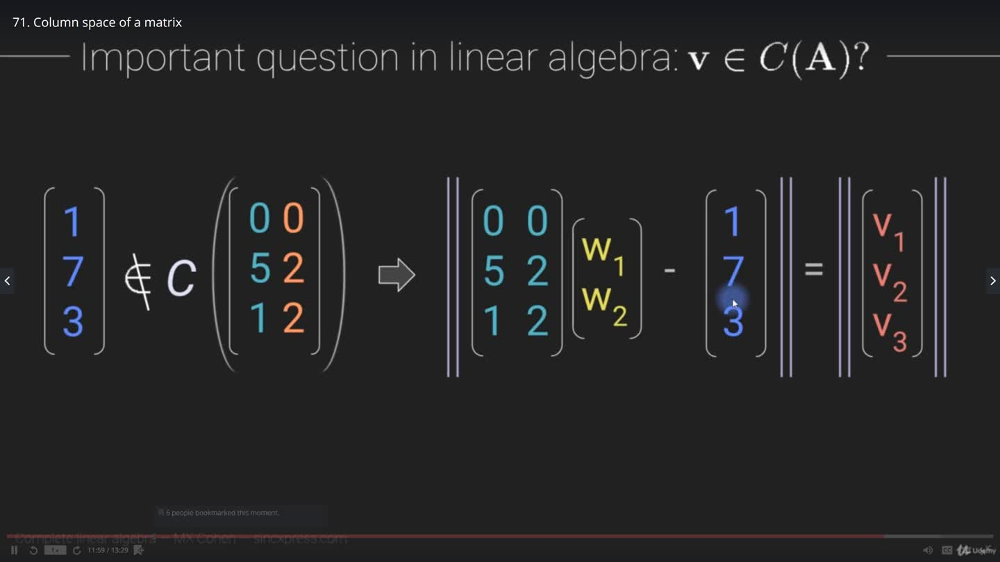

# Linear Algebra / Numpy Notes

## Numpy

- Numpy arrays are row-major (arranged row by row)

## Linear algebra

- linear algebra: the branch of math concerned with vectors/matrices
  - important for computing, statistics, data science, and graphics
  - linear algebra: focus on theory and proofs
  - matrix algebra: focus on practical application
- vector: ordered list of numbers
- matrix: 'spreadsheet' of numbers

## Dimensionality

- scalar: `1 * 1 (α, β, λ (regular))`
- vector: `1 * n (v, u, w (bold))`
- matrix: `n * n (A, M, C (bold))`

## Vectors

### Vector terminology

- vector: ordered list of numbers
  - column vector: vertical list
  - row vectors: horizontal list
- element: each item in a vector
- dimensionality: number of elements in a vector

- what defines a vector geometrically is the length and direction (start to end)
  - vectors can be geometrically equal but can have different locations
- vectors are geometrically robust to translation (or rigid body motion)
- standard position: when a vector starts at the origin

- head: start point
- tail: end point

### Vectors addition/subtraction

- algebraic addition
  - add corresponding elements (`v1[0] + v2[0] = v3[0]`)
  - vectors must have same dimensions (same number of elements)
- geometric addition
  - put tail of one vector to the head of the other
  - draw a vector that connects the tail of the first and the head of the second
- algebraic subtraction
  - minuend: first argument
  - subtrahend: second argument (the number being taken away)
  - negative addition: make the subtrahend negative and add the vectors
- geometric subtraction
  - make subtrahend negative
  - do same process as geometric addition
- geometric subtraction (v2)
  - draw both vectors in standard position
  - draw vector from subtrahend head to minuend head
  - this gives you the dimensions of the difference vector

### Vector multiplication (scalar)

- multiply each vector element by the scalar.
  - positive scalar : same direction,
  - negative scalar : opposite direction
  - `abs(λ) > 1` : gets longer,`
  - 0 < abs(λ) < 1` : vector shrinks
- all vectors that can be produced by scalar multiplication of a vector occupy the same subspace

### Vector multiplication (vector)

- dot product
- vectors need to have the same dimensions
- the result of the dot product is a scalar
- `sum v1[i]*v2[i]`
- the sum of the product of each associated element
- 'a transpose b' assumes they are both column vectors

  
Vector dot product

  

### Vector dot product (geometric perspective)

- vector dot product produces single value
  - `dot_product = magnitude_a * magnitude_b * cos(angle_between)`
  - `angle_between = arccos(dot_product / (magnitude_a * magnitude_b))`
- cos(angle_between):
  - positive if `angle_between < 90`
  - negative if `angle_between > 90`
  - 0 if `angle_between == 90` (orthogonal)
  - 1 if `angle_between == 0`
  - -1 if `angle_between == 180`
- law of cosines
  - `length_c^2 = length_a^2 + length_b^2 - (2 * at * b)`
  - `length_c^2 = length_a^2 + length_b^2 - (2 * length_a * length_b * cos(angle_between))`
  - `length_c^2 = (at * a) + (bt * b) - (2 * at * b)`
  - things to keep in mind about law of cosines
    - last term is 0 when orthogonal
    - `at * b = cos(angle_between) * length_a * length_b`
- `at * b = cos(angle_between) * length_a * length_b`

  
Orthogonal vectors

  

### Vector outer product

- dimensions:dv
  - `dot product = at * b`
    - `(1 x m) * (n x 1)` produces 1x1 matrix
    - only works if `m == n`
  - `outer product = a * bt`
    - `(m x 1) * (1 x n)` produces m x n matrix
- `np.outer(v1,v2)`
- `v1 @ v2.T`

  
Vector outer product

  

### Vector cross product (3d vectors)

- produces vector that is orthogonal to both vectors
- method 1
  - `a x b = length_a * length_b * sin(angle_between) * orthogonal_unit_vector`
- method 2
  - `cx = ay*bz - az*by`
  - `cy = az*bx - ax*bz`
  - `cz = ax*by - ay*bx`
- right hand rule
  - a: pointer
  - b: middle
  - c: thumb

### Hermitian transpose

- for vectors with only real numbers, hermitian transpose is the same as regular transpose.
- symbols
  - transpose: t
  - hermetian transpose: H or \*
- hermitian transpose:
  - transpose, flip sign of complex terms.
  - `(3 4i)` becomes `(3 -4i)`
- why we use conjugate:
  - `ztz = (3 4i)(3 4i) = -7 + 24i`
  - `zHz = (3 4i)(3 -4i) = 9 + 12i - 12i - 16i^2 = 9 + 16 = 25`

### Unit vector

- unit vector:
  - `scalar * length_v = 1`
  - `scalar = 1 / length_v`
  - zero vector has no unit vector (it lacks magnitude and direction)
  - for vector `[3 4]`, length = 5, mu = .2

### Dimensions and fields

- dimensions & fields
- fields
  - R: real numbers
  - Z: integers
  - C: complex numbers
- dimensions
  - `1,2,3,4,5, ... n`
- R2: 2 dimensional, real numbers
  - example: `[1 -2]`

### Subspaces

- subspaces:
  - subspace: a region of space that can be reached by any linear combination of the given vectors.
  - subspace (2): a vector space that is entirely contained within another vector space
  - hyperplane: a subspace whose dimension is one less than that of its ambient space
  - needs to include the origin
- subspace types:
  - ambient space (equal to the number of rows in a vector?),
    - R5: `[ 1 2 0 0 1 ]`
  - 0D (origin),
  - 1D (single vector),
  - 2D (plane created by two vectors that don't occupy the same vector subspace),
  - 3D,
  - 4D, ... nD
- subsets
  - a set of points that satisfies some condition(s)
  - doesn't need to include the origin, doesn't need to be closed, can have boundaries.

  
Subspace geometric perspective

  

  
Subspace geometric perspective (2)

  

### Span

- span (for a set of vectors): all possible linear combinations of all vectors in that set
- example:
  - vectors v and scalars a
  - `span = (a1 * v1) + (a2 * v2) ... + (ai * vi)`
- a vector is in the span of a set if it can be expressed as a linear combination of vectors from that set
- example:
  - vector `[1 2 0]` is within set `{ [1 1 0], [1 7 0] }`
  - `[1 2 0] = a1 * [1 1 0] + a2 * [1 7 0]`
  - a1 = 5/6
  - a2 = 1/6

  
Span

  

### Linear independence

- linear independence
  - a set is linearly dependent if:
    - a vector can be expressed by a linear combination of other rows.
    - eg: `[1 2 0] [2 4 0]`
    - eg: `[1 1 1] [1 2 3] [2 3 4]`
  - a set is linearly dependent if:
    - vectors `v` and scalars `a`
    - all `a` are real, and at least 1 `a` is non-zero
    - `a1*v1 + a2*v2 + ... an*vn = 0`
  - any set of `M > N` vectors in RN is dependent
  - any set of `M <= N` vectors in RN could be independent
- determine linear independence
  - count vectors, compare to dimensionality. (if there are more vectors than dimensions, it is dependent)
  - look at position of zeros (are any vectors all zeros?)
  - guess and test
  - matrix rank method (rank < number of vectors)
- rank: corresponds to the maximal number of linearly independent columns of A
- calculating rank:
  - reduce matrix to row echelon form (rref) using elementary row operations.
  - elementary row operations: row switching, row multiplication, row addition

  
Linear independence

  

### Basis (span and independence)

- standard basis vectors
  - R2: `[1 0] [0 1]`
  - R3: `[1 0 0] [0 1 0] [0 0 1]`
  - R4: `[1 0 0 0] [0 1 0 0] [0 0 1 0] [0 0 0 1]`
  - RN: `...`
  - unit length, mutually orthogonal (orthonormal)
- any point can be expressed by some unique linear combination of the vectors in its standard basis vectors

  
Standard basis vectors

  

  
Optimal basis vectors

  

## Matrices

### Intro

- matrix notation
  - Matrix: A
  - element: a1,2 (subscripts: row, column)
- diagonal elements
  - elements along the diagonal (from top left to bottom right)
  - for non-square, all elements aij where i=j
- sizing
  - 4x3: 4 rows, 3 cols
- reference
  - MxN: M rows, N cols
- RMN does not equal RMxN
- tensors
  - MxNxN

### Common matrices

- square (MxM)
- rectangle (MxN)
- symmetric (A = At)
- skew symmetric (almost symmetric. diagonal must be zeros and -A = At)
- identity matrix (ones on the diagonal, zeros on non-diagonal elements)
- diagonal matrix (matrix Aij where `ci*kronecker_delta`)
  - kronecker delta: 0 if i !=j, 1 if i = j
- upper triangular (matrix Aij where 0 if i > j)
- lower triangular (matrix Aij where - if i < j)
- concatenated (augmented): matrix A3 where A1 concatenated with A2 = A3
  - A1 and A2 must have same row count.
  - separator (vertical line) drawn to preserve separate identities.
    - eg: `[A | B]`
  - [augmented matrix](https://en.wikipedia.org/wiki/Augmented_matrix)

### Matrix add/subtract

- matrix addition and subtraction
  - A1 and A2 must have same diensions to add/subract
  - to add/sucbract, do element-wise operation.
  - commutative (can switch the order)
  - associative (grouping quantities does not affect the result)
- shifting a matrix
  - A + I\*scalar

### Matrix-scalar multiplication

- multiply each element by scalar
- commutative
- `A1*scalar*A2 = scalar*A1*A2 = A1*A2*scalar`
- `scalar * (A1 + A2) = scalar*A1 + scalar*A2`

### Matrix transpose

- transposing a vector (or matrix) is to flip the elements around the diagonal
- transposing twice will return the original vector (or matrix)

### Diagonal and trace

- diagonal elements (matrix Aij): Aij where i = j
- `trace = sum of diagonal elements`
- `trace = sum of eigenvalues`
- trace only exists for square matrices
- `trace(A1 + A2) = trace(A1) + trace(A2)`

### matrix multiplication

  
Matrix multiplication

  

### matrix multiplication validity

- standard matrix multiplication (matmul in python)
- A1 left-multiples A2 (not commutative)
- not commutative (`A1@A2 != A2@A1`)
- for two matrices (m x n), `A1[n]` must equal `A2[m]`
  - inner dimensions must match; eg: (4 x 2) and (2 x 5)
- `AtA` and `AAt` are ways to multipy a tall/wide matrix by itself
  - used in left-inverse and right-inverse
  - `AtA` and `AAt` produce matrices with different dimensions

### Matrix multiplication with a diagonal matrix

- `A@D`: modulate columns of A
- `D@A`: modulate rows of A

Example1 (`A@D`):

- `A1 = [[1 2 3], [4 5 6], [7 8 9]]`
- `A2 = [[a 0 0], [0 b 0], [0 0 c]]`
- `A1 @ A2 = [[a1 b2 c3], [a4 b5 c6], [a7 b8 c9]]`

Example2 (`D@A`):

- `A1 = [[a 0 0], [0 b 0], [0 0 c]]`
- `A2 = [[1 2 3], [4 5 6], [7 8 9]]`
- `A1 @ A2 = [[a1 a2 a3], [b4 b5 b6], [c7 c8 c9]]`

### Order of operations

- order of operations (matrices)
  - reversing matrix order when applying operation to multiplied matrices
  - sometimes the operator is valid for the product matrix, but not valid on each individual matrix
- operations examples
  - transpose: `(ABCD)t = Dt @ Ct @ Bt @ At`
  - inverse: `inv(ABCD) = inv(D) @ inv(C) @ inv(B) @ inv(A)`
    - not all matrices have an inverse
- `@` operator
  - https://docs.scipy.org/doc/numpy/reference/generated/numpy.matmul.html#numpy.matmul

## Frobenius dot product

- NOTE: both matrices must have same dimensions

- process 1
  - element-wise multiplication
  - sum all elements
- process 2
  - vectorize both matrices (concatenate columns together into a single column vector)
  - compute vector dot product
- process 3 (best)
  - product = `trace( At @ B )`
- frobenius norm (euclidean norm)
  - square root of frobenius dot product (of matrix with itself)
  - norm(A) = `sqrt(trace(At @ A))`

## Rank

- rank
  - matrix rank: the largest number of columns or rows that can form a linearly independent set
  - rank corresponds to dimensionality of the information contained in a matrix
  - rank is not necessarily equal to columns, rows, or ambient dimensionality
  - non-negative integer
  - maximum rank of matrix A (with dimensions (m x n)) is `min(m,n)`
- types
  - full rank matrix: square matrix (m x m) with maximum rank (r = m)
  - full column rank: tall matrix (m > n) (r = n)
  - full row rank: wide matrix (m < n) (r = m)
  - rank deficient: r < min(m,n)
    - other names: reduced rank, rank deficient, degenerate, low-rank
    - if square: singular (non-invertable)
- computing rank
  - count number of columns in a linearly independent set. (visual inspectiona dnd guesswork)
  - solving systems of equations (gaussian elimination)
  - apply row reduction to reduce matrix to echelon form, count number of pivots
  - compute SVD and count the number of non-zero singular values
  - compute the eigendecomposition and count number of non-zero eigenvalues
- maximum rank (addition and multiplication)
  - `rank(A + B) <= rank(A) + rank(B)`
  - `rank(AB) <= min(rank(A),rank(B))`
- transpose
  - `rank(A) = rank(AtA) = rank(At) = rank(AAt)`
- shifting to make matrix full-rank
  - for matrix A, scalar s, identity matrix I
  - shift: `A + s*I`
  - shifting can offset a square matrix enough to make it full rank
  - using a small scalar (ie: .01) in shift is called regularization (it's what he said)
  - makes a change of insignificant magnitude, but makes the matrix full rank.

## Spaces

- a matrix has four fundamental subspaces
  - row space
  - column space
  - null space
  - left-null space
- column space of a matrix
  - notation: C(A)
  - definition: the vector subspace spanned by the columns of A
    - set of all vectors that can be expressed by a linear combination of a matrix's columns.
  - a vector can only be in the same column space of a matrix that has equal column dimensions.
- is vector v in C(A)?
  - matrix with dimensions (m x n) has coef matrix (n x 1)
    - coef is a vector with length equal to the number of columns in A
  - yes: what coefficients are used to express v as a linear combination of columns in A?
    - `v = A*coef`
    - `A*coef - v = 0`
  - no: how close is v to being in C(A)?
    - `A*coef - v = distance_v`
    - `len(A*coef - v) = len(distance_v)`
    - least squares algorithm
      - solves for the value of 'coef' to minimize 'distance_v'
- row space
  - notation: R(A) or C(At)
  - number of coefficients will vary from C(A)
- column and row space
  - time series (with sensors)
  - R(A): combinations of time points (temporal filter)
  - C(A): combinations of sensors (spatial filter)
- null space
  - find the column vector that right multiplies a matrix to get a zeros vector.
  - matrix 'A', coefficient vector 'coef':
    - find values for 'coef' such that the following is true:
    - `A * coef = 0`
    - exclude trivial solution (zeros vector)
  - if linearly dependent: there is a null space
  - if linearly independent: no null space
  - if rank(A) == 0:
- left null space:
  - N(At)
  - `vt*A = 0t`
  - `At*v = 0`
- `A1*A2*v`
  - if v is in the null space of either matrix, then the result is a zeros vector.
- column spaces and left-null spaces are orthogonal.
- row spaces and null spaces are orthogonal.
- Ax = b
  - finding the minimum of `magnitude(b_hat - b)`
  - least squares, linear regression
- `Ax = b`
  - matrix A, vector x, vector b
  - has a solution if b is in C(S)
- `Ax = b_hat`
  - if b is not in C(A), use b_hat
  - b_hat is a vector that is in C(A) and close to b
  - least squares solution
    - find b_hat vaue where magnitude(b_hat - b) is smallest.
- `(A - g*I)x = 0  `
  - gamma: eigenvalue
  - x: eigenvector
  - characteristic equation
- how to solve `(A - g*I)x = 0`
  - PCA: principle components analysis
  - GED: generalized eigendecomposition
  - SVD: singular value decomposition
  - LDA: fisher linear discriminant analysis
- characteristic equation
  - `det(A - g*I) = 0`
  - used to find eigenvalues (gamma)
- `X*Beta = y`
  - design matrix, regression coefficients, observed data
  - used in statistics

  
Column Space (1)

  

  
Column Space (2)

  

  
Column Space (3)

  

  
Row Space

  

  
Null space

  

  
Subspace unions

  

  
Four subspaces example

  

  
Ax = b (1)

  

  
Ax = b (2)

  

  
Ax = b (3)

  

  
Ax = b (4)

  

## Dimensionality, rank, and null space

- matrix A is a full rank, (3x3) matrix:
  - `rank(A) = 3`
  - `N(A) = {}`
  - `dim( N(A) ) = 0`
  - `dim( C(A) ) = 3`
- matrix A is a rank-deficient, (2x2) matrix:
  - `rank(A) = 1`
  - `N(A) = [1, 1]`
  - `N(At) = [-2, 1]`
  - `dim( N(A) )`
  - `dim( C(A) )`
- matrix A with dimensions (m x n)
  - column space is orthogonal to left-null space.
  - row space is orthogonal to null space.
  - `dim(ambient space) = dim( C(A) ) = dim( N(At) )`
  - `m = dim( C(A) ) + dim( N(At) )`
  - `n = dim( C(At) ) + dim( N(A) )`

## Systems of linear equations

- the point of the below illustration
  - the equations are combined in random ways
  - the resulting equations still have the same point of intersection
- converting systems of equations into matrix equations
  - coefficients, variables, constants
  - organize like the following:
    - `2x + 3y - 4z = 5`
    - `-x + 7y + 9z = 7`
  - be mindful of variables and position (if any equations don't have all variables\_)
  - create `Ax = b`
    - `matrix[[2 3 -4][-1 7 9]] * vector[x y z] = vector[5 7]`
- gaussian elimination
  - convert system to matrix-vector equation
  - augment the coefficients matrix with the vector of constants
  - use gaussian elimination to create a upper triangle matrix with ones on the diagonal
    - add multiples of one equation to another equation
    - switch row order
    - multiply a row by its scalar
  - map the matrix back to the equations (re-attach coefficients to variables)
  - back-substitution to solve for variables
  - check work using original system
- echelon form
  - pivots: first value in a row.
  - all values left of and below pivots must be zero
  - pivots will get messed up in a rank deficient matrix
- rref
  - same as echelon form, but additionally:
  - each pivot must be the only value in its column
  - each pivot must be 1
- rref loses information. (multiple different matrices can have the same rref)
- gaussian elimination: `raw => echelon_form => rref`

  
Systems of equations (1)

  

  
Systems of equations (2)

  

  
Upper triangular matrix

  

  
Echelon form

  

  
Echelon form example

  

  
Reduced row echelon form

  

## Determinant

- determinant
  - only square matrices have a determinant
  - matrix is non-singular (has an inverse) if determinant is non-zero
  - matrix is singular (has no inverse) if determinant is zero
- `2x2`
  - `[ [a,b], [c,d] ]`
  - `ad - bc`
- `3x3` (diagonal method)
  - `[ [a,b,c], [d,e,f], [g,h,i] ]`
  - `aei + bfg + cdh - afh - bdi - ceg`
  - `a * (ei - fg) + b * (fg - di) + c * (dh - eg)`
  - `a * det(efhi) + b * det(fidg) + c * det(degh)`
- faces
  - square has 2 faces
    - 2x2 det has 2 terms
  - cube has 6 faces
    - 3x3 det has 6 terms
  - tesseract has 24 faces
    - 4x4 det has 24 terms
- switching rows will negate the determinant
- numpy
  - `np.linalg.det(A)`
  - to test for singularity, use `np.linalg.cond(A)`

  
Determinant

  

  
Determinant (1)

  

  
Determinant (2)

  

  
Determinant (3)

  

  
Determinant (4)

  

## Matrix inverse

- matrix inverse (for square matricies)
  - `A @ Ainv = Ainv @ A = identity matrix`
  - solving for x (why inverse is necessary)
    - `Ax = b`
    - `Ainv @ A * x = Ainv * b`
    - `I * x = Ainv * b`
    - `x = Ainv * b`
  - matrix inverse is side-dependent
    - `AB = C`
    - `Ainv @ A @ B = Ainv @ C`
    - if you left multiply on one side, you have to the same so on the other. (same with right)
  - invertible (non-singular) matrix:
    - square
    - full rank
  - avoid explicit use of inverse in code. It won't behave correctly
- find matrix inverse (2 x 2) (invertible matrix):
  - swap diagonal elements
  - invert signs of off-diagonal elements
  - divide each element by the determinant
- matrix inverse (for square, invertible matrix) using MCA algorithm
  - check determinant first, see if it is invertible.
  - solve for M, then C, then Ainv
  - terms:
    - minor: the determinant after removing the row/column a value is in.
    - cofactor: a minor with its correct sign (`value * (-1)^(i+j)`)
  - M: minors matrix: a matrix of determinants
    - replace each element with its minor.
  - C: cofactors matrix: the minors matrix hadamard multiplied by a grid of alternating `+-`
    - matrix Hij where the sign is `(-1)^(i + j)`
      - positive if `i+j` is even, negative if i+j is odd
    - `cofactor matrix = M * H`
      - hadamard product between minors matrix and alternating signs matrix
  - A: adjugate matrix: the transpose of the cofactors matrix, divided by the determinant
    - `Ct * (1/determinant)`
    - transpose cofactor matrix, divide each element by the determinant

### Matrix inverse (row reduction and RREF)

  
Inverse RREF

  

### Row Reduction

inverse of A using row reduction

- concatenate `A` and `I`
  - in general: when concatenating, `A1` and `A2` must have same number of cols
- `I_Ainv_aug = rref(A_I_aug)`
  - if rref does't produce identity matrix on left, matrix is singular
- to find `Ainv`, just remove `I` from `I_Ainv_aug`

### Left and right inverse (one-sided)

Inverse for tall or wide matrices

- `I = inv(AtA) @ (AtA)`
- left inverse
  - must have full column rank (tall matrix, `m>n`)
  - solve
    - `inv(AtA) @ (AtA) = I`
    - `left_inv(A) = inv(AtA) @ At`
    - `left_inv(A) @ A = I`
- right inverse
  - must have full row rank (wide matrix, `m<n`)
  - solve
    - `(AAt) @ inv(AAt) = I`
    - `right_inv(A) = At @ inv(AAt)`
    - `A @ right_inv(A) = I`

## Projections

  
Projections (R2)

  

  
Projections (RN) (1)

  

  
Projections (RN) (2)

  

### projections in R2

- vector a, point b, scalar beta
- concept
  - projecting point b onto line a
  - projecting coordinate/vector b onto a subspace defined by vector a
  - projection of b onto a is a scaled version of a
    - `proj_a_b = beta*a`
- find a value for beta where:
  - the distance between beta\*a and b is minimal
  - that line is: b - a\*beta
  - that point should form a line to b that is orthogonal to a
    - `at @ (b - a * beta) = 0`
    - `at @ b - at @ a * beta = 0`
    - `at @ a * beta = at @ b`
    - `beta = (at @ b) / (at @ a)`
      - `beta = mapping / magnitude`

### projections in RN

- `AtA` must be full rank
- `At @ (b - Ax) = 0`
- `At @ b - At @ A * x = 0`
- `At @ A * x = At @ b`
- `inv(At @ A) * (At @ A) * x = inv(At @ A) @ At @ b`
- `x = inv(At @ A) @ At @ b`
- `x = inv(A) @ inv(At) @ At @ b`
- `x = inv(A) @ b`

- what this means
  - `Cx = d`
    - vector `d` is in the column space of matrix `C`
    - elements in `x` tell us the weights/coefficients to get `C` => `d`
      - `x` tells us how to matrix-vector multiply `C*x` to get `d`
    - `x = inv(C) * d`
  - `At @ A * x = At * b`
    - `x = inv(At @ A) @ At * b`
    - `x = inv(A) * b`
- the goal here is to solve Ax=b for x
- explained above as 'Cx = d'

## Separating components of a vector

- orthogonal and parallel vector components
  - vector w, vector v
  - `w = w_parallel_v + w_orthogonal_v`
- solving
  - w_par_v is in the subspace defined by v
  - solve for w_par_v
    - use projections
    - `w_par_v = proj_v_w = (wt*v)/(vt*v) * v`
  - solve for w_orth_v
    - `w_orth_v = w - w_par_v`
  - check work:
    - product should equal 0 (orthogonal)
    - sum should equal w

  
Components of a vector (1)

  

  
Components of a vector (2)

  

  
Orthogonal matrix

  

## Gram-schmidt procedure (unstable)

- orthogonal matrix
  - all columns are pairwise orthogonal
  - each column has a magnitude of 1
  - Qij where 1 if `i=j`, 0 if `i!=j`
    - ???? where is kronecker's delta used here ????
  - `QtQ = QQt = I = Q @ inv(Q) = inv(Q) @ Q`
  - `Qt = inv(Q)`
- for each column: find the orthogonal part, relative to the orthogonalized columns before it
- make each column unit length
- process
  - convert a1 to unit length
  - `a2 = a2 - a2_par_a1`
  - `a3 = a3 - a3_par_a1 - a3_par_a2`

  
Gram-Schmidt procedure

  

  
Upper triangular matrix (2)

  

## QR Decomposition

- A = QR
  - A (mxn)
  - Q (mxm) is an orthogonal matrix
  - R (mxn) is an upper right matrix
- get Q
  - gram-schmidt procedure
- get R
  - Q is orthogonal, so `inv(Q)` is `Q.T`
  - `QtA = QtQR`
  - `QtA = R`

  
QR Decomposition example

  

## QR for matrix inverse

- `A = QR`
- `inv(A) = inv(QR)`
- `inv(A) = inv(R) @ Qt`

  
QR decomp for matrix inverse

  

## sherman-morrison inverse

- matrix A, vectors a & b
- `A = I - a @ bt`
- `inv(A) = I + (a @ bt) / (1-at*b)`
- `A @ Ainv = (1 - a @ bt)(I + (a @ bt) / (1 - at*b))`
  - expand out and combine terms with denominator
- `A @ Ainv = I - a @ bt + (a @ bt - (a @ bt) @ (a @ bt)) / (1 - at*b)`
  - `bt * a` is a scalar
  - numerator: `a@bt - a@bt(scalar) = a@bt * (1 - bt*a)`
- `A @ Ainv = I - a@bt + (a@bt(1-bt*a)/(1 - at*b))`
  - for vectors: `at*b = bt*a` (produces scalar)
- `A @ Ainv = I - a*bt + a*bt = I`

# AtA = RtR

- A is matrix A
- R is matrix R from QR decomposition -- A = QR

## Model fitting

`Ax + B = 0`

### Least squares

  
Ax = b (1)

  

  
Ax = b (2)

  

  
Ax = b (3)

  

  
Ax = b (4)

  

  
Least squares (RREF) (1)

  

  
Least squares (RREF) (2)

  

  
Rediduals

  

  
Least squares using QR decomposition

  

#### linear algebra perspective

- output_value = `s1*factor1 + s2*factor2 + s3*factor3 + s4*factor4 + intercept`
  - 'factor' represents fixed feature (independent variable) (input variable)
  - 'intercept' represents the output value when the s\*factor terms are 0.
  - 's' represents scalars (weights)
    - during model fitting, s is modified
  - to solve for each scalar
    - get a bunch of examples with known inputs/outputs, solve for scalars
- steps of model fitting
  - define the equations underlying the model
  - map thee data into the model equations
  - convert the equations into a matrix-vector equation
  - compute free parameters (scalars)
  - statistic evaluation of model
- overview
  - `A @ x = b`
  - dimensions: A (records x factors), x (factors x 1), b (records x 1)
- equations
  - `180 = s1*1 + s2*175 + s3*8`
  - `170 = s1*0 + s2*172 + s3*6`
  - `176 = s1*0 + s2*189 + s3*7`
- matrix vector equations
  - `[1 175 8]   [s1]   [180]`
  - `[0 172 6] @ [s2] = [170]`
  - `[0 189 7]   [s3]   [176]`

#### statistics perspective

- perfect world
  - `y = X @ Beta`
    - y: vector of dependent variables
    - X: design matrix
    - Beta: regression coefficients
- account for error
  - `y = X @ Beta + epsilon`
    - y: vector of dependent variables
    - X: design matrix
    - Beta: vector of regression coefficients,
    - epsilon: vector connecting y_pred with y_actual (gets y into C(X))
  - `Beta = inv(Xt @ X) @ Xt @ y_hat`
    - y_hat is in C(X)
    - `y = X @ Beta + epsilon`
    - `y + epsilon` is in C(X)
  - projections
    - `Beta = inv(Xt @ X) @ Xt @ y`
    - `X @ Beta = y + epsilon`

#### projections in RN

- AtA must be full rank
- `At @ (b - Ax) = 0`
- `At @ b - At @ A * x = 0`
- `At @ A * x = At @ b`
- `inv(At @ A) * (At @ A) * x = inv(At @ A) @ At @ b`
- `x = inv(At @ A) @ At @ b`
- `x = inv(A) @ inv(At) @ At @ b`
- `x = inv(A) @ b`

#### least squares (left inverse)

- `Ax = b`
  - multiply by left inverse
- `inv(At @ A) @ At @ A @ x = inv(At @ A) @ At @ y`
  - cancel out left inverse and A
- `x = inv(At @ A) @ At @ b`

#### conditions (left inverse)

- tall matrix
- full column rank (to avoid multicollinearity)

#### least squares (row reduction)

- slower, less accurate, less insightful than orthogonal projection method and left verse method
- process
  - matrix X with dimenions (m, n)
  - normal equation
    - `X @ Beta = y`
    - `(Xt @ X) @ Beta = Xt @ y`
  - covariance matrix
    - `At @ A` is the covariance matrix of A (NOT SURE ABOUT THIS ONE)
  - row space
    - `R(Xt @ X) = R(X)`
  - column space (why row reduction works for `(Xt @ X) @ Beta = Xt @ y`)
    - if X is non-singular (full rank), then the At @ A matrix spans all of RN
    - `Xt @ X` spans all of RN, Xt @ y is a point in RN
  - dimensions
    - `Xt @ X`: (n x n)
    - `Xt @ y`: (n x 1)
  - concatenate
    - `[ Xt @ X | Xt @ y ]`
  - `rref([ Xt @ X | Xt @ y ])`
    - produces `[I | B]`

#### model-predicted values and residuals

- models rarely (never) predict values perfectly
- predicted values fall in the column space of the fitted model
- observed values (most often) fall outside the column space of the fitted model
- adding a vector (residual) to connect the predicted/observed values
- `X @ Beta = y + epsilon`
- epsilon is an orthogonal projection from y to X
- finds the closest `X @ Beta` to y (shortest epsilon)
- `X @ Beta = y_hat = y + epsilon`
  - `X @ Beta`: predicted value (point along vector X)
  - y_hat: predicted
  - y: observed;
  - epsilon: vector between predicted and observed
- epsilon = `XB - y`

#### epsilon and least squares

- magnitude of epsilon indicates the quality of the model fitting
- `epsilon^2 = (X @ Beta - y)^2`
- change Beta to minimize epsilon

#### least squares via QR decomposition

- `X @ Beta = y`
- `Xt @ X @ Beta = Xt @ y`
- `(Q @ R)t @ Q @ R @ Beta = (QR)t @ y`
- `Rt @ Qt @ Q @ R @ Beta = (QR)t @ y`
  - `Qt @ Q = I`
- `Rt @ R @ Beta = (QR)t @ y`
  - left multiply both sides by (`Rt @ R`)
- `Beta = inv(Rt @ R) @ (Q @ R)t @ y`

## Decomposition

  
Diagonalization

  

  
Reminder of diagonal matrix multiplication

  

  
Eigenlayers

  

  
SVD

  

  
SVD spectral theory

  

  
SVD spectral theory layers

  

  
SVD layers

  

### Eigendecomposition

- only defined for square matrices
- for matrix A with dimensions (m x m)
  - there are m eigenvalues
  - there are m eigenvectors
  - each eigenvalue has an associated eigenvector
  - sometimes there are repeated eigenvalues
- geometric interpretation
  - `A @ v = w`
    - A is a transformation matrix that changes v to w
  - `lambda @ v = w`
  - `lambda @ v = A @ v`
- finding eigenvalues
  - `A @ v = lambda @ v`
  - `A @ v - lambda @ v = 0` (zero as a vector)
  - `(A - lambda * I) @ v = 0`
- characteristic equation
  - `det(A - gamma * I) = 0` (zero as a value)
  - solve for gamma
- find eigenvalues
  - NxN matrix has n eigenvalues
  - trace = sum of eigenvalues = sum of diagonal elements
  - determinant = product of eigenvalues
- shortcuts
  - eigenvalues of diagonal, upper triangle, and lower triangle matrices are the diagonal elements.
  - symmetric matrices always have real values for eigenvalues
  - if matrix is singular, at least one eigenvalue is 0
    - determinant is product of eigenvalues (determinant of singular matrix is 0)
    - rank is equal to the number of non-zero eigenvalues
- find eigenvectors
  - first, find eigenvalues
  - for each eigenvalue:
    - find a vector that exists in N(A - gamma \* I)
    - that vector is the eigenvector for the eigenvalue used
  - process
    - `Ax = b`
    - `(A - lambda * I) @ eigenvector = 0` (zero as a vector)
- eigenvector is essentially a basis vector for a subspace

### Diagonalization

- diagonalization (sometimes called eigendecomposition)
  - `A @ V = V @ (lambda * I)`
  - `A @ P = P @ D`
  - `A = P @ D @ inv(P)`
    - A: original matrix
    - P: matrix of eigenvectors
    - D: diagonalized matrix of eigenvalues
    - inv(P): inverse(matrix of eigenvectors)
  - preserve order/association of eigenvalues/eigenvectors
- example
  - `A = P @ D @ inv(P)`
    - `A` is a matrix like `At @ A`
    - `P` is a matrix with eigenvectors as columns
    - `D` is the diagonal matrix with eigenvalues along the diagonal
  - `A = V @ Lambda @ inv(V)`
- matrix powers via diagonalization
  - `A = P @ D @ inv(P)`
  - `A^n = P @ (D^n) @ inv(P)`
    - `D^n`: each diagonal element to the power of `n`

### Eigenlayers

- `A = V @ Lambda @ inv(V)`
  - A: matrix
  - V: matrix of eigenvectors of A
  - Lambda: diagonal matrix of eigenvalues
- `A_i = v_i _ lambda_i _ (inv(v_i))t`
  - A_i: layer
  - v_i: vector column from V (eigenvector)
  - lambda_i: corresponding eigenvalue column from Lambda
  - `(inv(v_i))t`: vector column from `inv(V)`
- `A = sum( v_i _ lambda_i _ (inv(v_i))t )`
  - sum of layers

### Generalized eigendecomposition

- regular eigendecomposition is a special case of generalized eigendecomposition
  - `A @ v = lambda * R @ v`
  - special case where R is I
- GED (v1)
  - `A @ v = lambda * R @ v`
  - `inv(R) @ A @ v = gamma * v`
- GED (v2)
  - `A @ v = lambda * R @ v`
  - `(A - lambda * R) @ v = 0`

### SVD (singular value decomposition)

- eigendecomposition is very similar to SVD, when m = n
  - `A = P @ D @ inv(P)`
  - `A = U @ S @ Vt`
- [svd vs eigendecomposition](https://math.stackexchange.com/a/320232)
- prerequisites
  - `At @ A is symmetric`
    - `(At @ A)t = At @ Att = At @ A`
    - remember to reverse matrix order when applying operation to multiplied matrices
  - `S = At @ A`
    - S: square matrix dimensions (n x n)
    - At: matrix dimensions (n x m)
    - A: matrix dimensions (m x n)
  - `S = A @ At`
    - S: square matrix dimensions (m x m)
    - A: matrix dimensions (m x n)
    - At: marix dimensions (n x m)
  - space
    - `R(At @ A) = R(A)`
    - `C(A @ At) = C(A)`
- SVD
  - `A = U @ Sigma @ Vt`
    - A: matrix dimensions (m x n)
    - U: matrix dimensions (m x m)
      - orthogonal basis for column space of A
      - eigenvectors of `A @ At`
    - Sigma: matrix dimensions (m x n)
      - singular values of A
    - Vt: matrix dimensions (n x n)
      - orthogonal basis for row space of A
      - eigenvectors of `At @ A`, transposed
  - `At @ A`
    - `At @ A = (U @ S @ Vt)t @ (U @ S @ Vt)`
    - `AtA = Vtt @ St @ Ut @ U @ S @ Vt`
      - `Ut @ U` is `I` (multiplying orthogonal matrices)
    - `AtA = V @ St @ I @ S @ Vt`
      - `St @ S = S^2` (diagonal matrix)
      - `S^2`: just square each element (property of diagonal matrices)
    - `AtA = V @ S^2 @ Vt`
      - V: left singular vectors of `At @ A`
      - S^2: eigenvalues of `At @ A`
        - S: singular values of `At @ A`
      - Vt: right singular vectors of `At @ A` (transposed)
  - `A @ At`
    - `AAt = (U @ S @ Vt) @ (U @ S @ Vt)t`
      - operation on multiplied vatrices, `Vt @ V = I, S @ St = S^2`
    - `AAt = U @ S^2 @ Ut`

### SVD Spectral theory

- spectral theory of matrices
  - represent a complex matrix as a sum of into simpler components
  - Each combination from `U @ Sigma @ Vt` represents a layer of `A`
    - `layer1 = u1 @ Sigma1 @ Vt1`
- spectral theory example
  - 2D gaussian kernel for smoothing
  - 2D convolution with gaussian kernel
  - compare A to C,
    - A: the original, smoothed matrix
    - C: the matrix that represents the sum of the first 5 'layers' produced by SVD

## Pseudoinverse

- pseudoinverse for singular matrix
  - singular matrix? use pseudoinverse
  - pseudoinverse and full inverse are equivalent for invertable matrices
  - commutative property
    - pseudoinverse: `A @ Apinv != Apinv @ A`
    - full inverse: `A @ Ainv = I = Ainv @ A`
  - don't use (-1) to denote pseudoinverse. use asterisk or dagger.
- Moore-Penrose Pseudoinverse
  - uses SVD (not shown in this section)
  - Moore-Penrose pseudoinverse is unique, but there are other pseudoinverses
- Pseudoinverse using SVD
  - `A = U @ S @ Vt`
  - `Ainv = V @ (inv(S))t @ Ut`
  - `S => Sinv`: get reciprocal of each (non-zero) diagonal element

  
Pseudoinverse

  

  
SVD pseudoinverse

  

## Condition number

Condition number of a matrix

- condition number: K (Kappa)
- indicate the spread of information for a matrix
- condition number = max singular value / min singular value
- trend (with exceptions):
  - large condition number: ill conditioned (sensitive to perturbations)
  - small condition number: well conditioned (insensitive to perturbations)
- singular matrices: `K = n / 0`
  - they can still provide useful information

## Additional notes

- vectors/matrices
  - https://courses.lumenlearning.com/boundless-algebra/chapter/introduction-to-matrices/
  - https://web.stanford.edu/class/nbio228-01/handouts/Ch4_Linear_Algebra.pdf
  - https://math.boisestate.edu/~wright/courses/m565/LABackground.pdf
- linear algebra review
  - http://cseweb.ucsd.edu/classes/wi05/cse252a/linear_algebra_review.pdf
  - https://minireference.com/static/tutorials/linear_algebra_in_4_pages.pdf
  - http://cs229.stanford.edu/section/cs229-linalg.pdfv
  - http://www.cs.toronto.edu/~bonner/courses/2016s/csc321/readings/optional/la.pdf
- symbols
  - https://en.wikipedia.org/wiki/List_of_mathematical_symbols_by_subject#Linear_algebra_and_geometry
- greek alphabet
  - https://www.rapidtables.com/math/symbols/greek_alphabet.html
    - matrix multiplication
  - https://en.wikipedia.org/wiki/Matrix_multiplication#Illustration
- cross product of vectors
  - https://en.wikipedia.org/wiki/Cross_product
  - https://betterexplained.com/articles/cross-product/
- "@" infix operator
  - https://docs.scipy.org/doc/numpy/reference/generated/numpy.matmul.html#numpy.matmul
- reduced row echelon form (rref) (gaussian elimination)
  - http://www.math.jhu.edu/~bernstein/math201/RREF.pdf
  - https://stattrek.com/matrix-algebra/echelon-transform.aspx
  - https://newonlinecourses.science.psu.edu/statprogram/reviews/matrix-algebra/gauss-jordan-elimination
- solve system of equations (using inverse)
  - https://courses.lumenlearning.com/boundless-algebra/chapter/using-matrices-to-solve-systems-of-equations/
- orthogonality
  - http://www.math.harvard.edu/~knill/teaching/math19b_2011/handouts/lecture17.pdf
- properties of determinants (shortcuts)
  - https://www.math10.com/en/algebra/matrices/determinant.html
- determinant (4x4)
  - https://en.wikipedia.org/wiki/Laplace_expansion#Laplace_expansion_of_a_determinant_by_complementary_minors
  - http://mathcentral.uregina.ca/QQ/database/QQ.09.07/h/rav1.html
  - https://www.geometrictools.com/Documentation/LaplaceExpansionTheorem.pdf
  - http://pi.math.cornell.edu/~andreim/Lec16.pdf
- laplace expansion (cofactor expansion)
  - https://en.wikipedia.org/wiki/Laplace_expansion
  - https://textbooks.math.gatech.edu/ila/determinants-cofactors.html
  - https://en.wikibooks.org/wiki/Linear_Algebra/Laplace%27s_Expansion
  - http://calvino.polito.it/~adiscala/didattica/Lingotto/2009/English/Lectures/EN-LeLing12.pdf
- inverse using cofactors
  - https://math.vanderbilt.edu/rolenl/LinearAlgebraNotes10.pdf
- eigenvectors, eigenvalues, eigen decomposition
  - http://mathworld.wolfram.com/Eigenvector.html
  - http://mathworld.wolfram.com/EigenDecomposition.html
  - http://mathworld.wolfram.com/Eigenvalue.html
- calculating eigenvectors & eigenvalues
  - http://homepages.ed.ac.uk/hopkinse/eigen
  - https://www.adelaide.edu.au/mathslearning/play/seminars/evalue-magic-tricks-handout.pdf
  - https://math.mit.edu/~gs/linearalgebra/ila0601.pdf
  - https://lpsa.swarthmore.edu/MtrxVibe/EigMat/MatrixEigen.html
  - https://personal.utdallas.edu/~herve/Abdi-EVD2007-pretty.pdf
  - https://math.mit.edu/~gs/linearalgebra/ila0601.pdf
  - http://www.sosmath.com/matrix/eigen2/eigen2.html
  - https://www.scss.tcd.ie/Rozenn.Dahyot/CS1BA1/SolutionEigen.pdf
  - http://wwwf.imperial.ac.uk/metric/metric_public/matrices/eigenvalues_and_eigenvectors/eigenvalues2.html
- diagonalization
  - https://yutsumura.com/how-to-diagonalize-a-matrix-step-by-step-explanation/
  - http://mathworld.wolfram.com/MatrixDiagonalization.html
  - http://mathworld.wolfram.com/DiagonalMatrix.html
  - http://mathworld.wolfram.com/DiagonalizableMatrix.html
  - https://math.stackexchange.com/questions/1064229/how-to-diagonalize-this-matrix/1064245
  - https://math.okstate.edu/people/binegar/3013-S99/3013-l16.pdf
  - https://en.wikipedia.org/wiki/Diagonalizable_matrix
- singular value decomposition (SVD)
  - https://pdfs.semanticscholar.org/62d0/2af1b4105fbb527d6509c1356e553781aa06.pdf
  - http://www.d.umn.edu/~mhampton/m4326svd_example.pdf
  - https://en.wikipedia.org/wiki/Singular_value_decomposition
  - http://www.sci.utah.edu/~gerig/CS6640-F2012/Materials/pseudoinverse-cis61009sl10.pdf
  - https://www.cs.cmu.edu/~venkatg/teaching/CStheory-infoage/book-chapter-4.pdf
  - http://web.mit.edu/be.400/www/SVD/Singular_Value_Decomposition.htm
- pseudo-inverse
  - https://www.cs.bgu.ac.il/~na181/wiki.files/SVD_application_paper[1].pdf
  - https://pdfs.semanticscholar.org/62d0/2af1b4105fbb527d6509c1356e553781aa06.pdf
  - http://www.sci.utah.edu/~gerig/CS6640-F2012/Materials/pseudoinverse-cis61009sl10.pdf
  - https://help.matheass.eu/en/Pseudoinverse.html
  - https://www.johndcook.com/blog/2018/05/05/svd/
  - http://www.sci.utah.edu/~gerig/CS6640-F2012/Materials/pseudoinverse-cis61009sl10.pdf
  - https://en.wikipedia.org/wiki/Moore%E2%80%93Penrose_inverse
  - https://math.stackexchange.com/questions/2624440/how-to-find-moore-penrose-inverse
- QR decomposition (QR factorization) (Gram-Schmidt algorithm)
  - http://www.cs.nthu.edu.tw/~cherung/teaching/2008cs3331/chap4%20example.pdf
  - http://www.math.drexel.edu/~foucart/TeachingFiles/F12/M504Lect3.pdf
  - https://www.math.ucla.edu/~yanovsky/Teaching/Math151B/handouts/GramSchmidt.pdf
  - http://www.seas.ucla.edu/~vandenbe/133A/lectures/qr.pdf
  - https://en.wikipedia.org/wiki/QR_decomposition
  - http://ee263.stanford.edu/lectures/qr.pdf
- LU decomposition (gauss elimination)
  - http://www.math.iit.edu/~fass/477577_Chapter_7.pdf
  - http://www.ohiouniversityfaculty.com/youngt/IntNumMeth/lecture12.pdf
  - http://mathonline.wikidot.com/the-lu-decomposition-of-a-matrix
  - http://mathonline.wikidot.com/the-lu-decomposition-of-a-matrix-examples-1
  - https://math.libretexts.org/Special:Search?qid=&fpid=230&fpth=&path=&q=lu+qr
  - http://mathworld.wolfram.com/GaussianElimination.html
  - https://en.wikipedia.org/wiki/LU_decomposition
  - https://www.geeksforgeeks.org/l-u-decomposition-system-linear-equations/
  - http://mathworld.wolfram.com/LUDecomposition.html
- quadratic form
  - https://see.stanford.edu/materials/lsoeldsee263/15-symm.pdf
  - http://www2.econ.iastate.edu/classes/econ501/Hallam/documents/Quad_Forms_000.pdf
  - http://www.columbia.edu/~md3405/Linear%20Algebra.pdf
- principle component analysis (PCA)
  - http://www.math.union.edu/~jaureguj/PCA.pdf
- fourier transform
  - https://betterexplained.com/articles/an-interactive-guide-to-the-fourier-transform/
