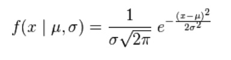
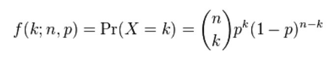
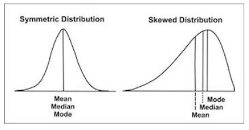
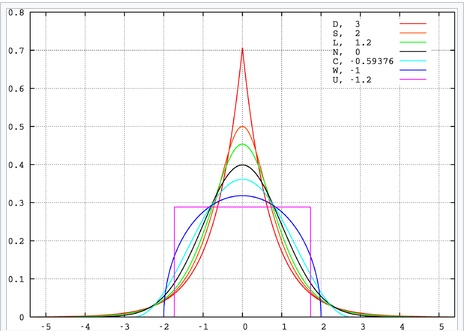
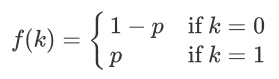
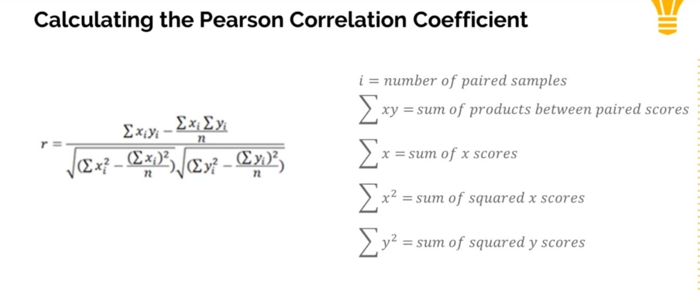
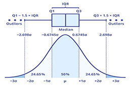

# Statistics (in Python)

[scipy stats](https://docs.scipy.org/doc/scipy/reference/stats.html)

## Statistics subfields

- Descriptive statistics: Measures or descriptions used to assess some performance or indicator (ie: GPA, batting averages)
- Inferential statistics: Using knowledge from data to make informed inferences
- Risk and probability: Likelihood of outcomes (important to insurance and finance companies)
- Correlation and relationships: Hypothesis testing, establishing correlations.
- Modeling: Making models, running simulations, predicting outcomes.

## Variables and Distributions

- Random variable: variable whose value is subject to variations due to chance.
- Discrete random variables: categorical variables (countable number of possible values)
- Continuous random variables: numerical variables (infinitely many possible values)

- Frequency distribution: how often "something" appears within a dataset
  - "something" is a value (discrete) or range of values (continuous)

## Distributions

- Continuous
  - Normal distribution: gaussian distribution, bell shaped sitribution
    - mean 0, std 1
    - 68% within 1 std, 95% within 2 std, 99.7 within 3 std
  - Uniform distribution: all values have same frequency
  - Exponential distribution: the time between occurrences of successive events as time flows by continuously.
- Discrete
  - Bernoulli distribution: yes/no question (q = 1 - p) (prob_of_failure = 1 - prob_of_success)
  - Binomial distribution: the number of successes in a fixed number of independent trials,
  - Negative binomial distribution: the number of successes until threshold of failures is met.
  - Geometric distribution: the time between successes in a series of independent trials.
  - Poisson distribution: the number of occurrences in a fixed period of time,

  
Gaussian distribution

  

  
Binomial distribution

  

### Distribution functions

- Probability distribution: each measureable subset of possible outcomes is assigned a probability.
- Probability mass function (pmf): prob that a discrete random var is exactly equal to some value
- Discrete probability distribution (cumulative mass function)
  - Prob distribution characterized by pmf
- Probability density function (pdf): func that describes relative likelihood for random var to take given value
- Continous probability distribution (cumulative density function) (cdf)
  - Prob that var takes value <= x
- Central limit theorem: distribution of sample means approximates a normal distribution
  - Large num of iterations, certain conditions, produces normal distribution.

### Frequency distribution metrics

- mean: average
- median: middle value
- mode: most frequent appearance
- variance: for a set, how spread the values are from the mean
  - `sum(x_i - x_mean) ** 2 / (observations - 1)`
- standard deviation: for a set, how spread the values are from the mean
  - `sqrt( sum(x_i - x_mean) ** 2 ) / (observations - 1)`
    - population: use `observations`; sample: use `observations - 1` (bessel's correction)
  - ie: the sqrt of variance
  - interpretation
    - the output is in the same terms as the original data
    - easier to interpret than variance
- skew: measure of asymmetry in prob distribution
- kurtosis measure of pointedness/sharpness of peak of a freq-distribution curve
- SEM (standard error of the mean)
  - range around mean that future replicate experiments will most likely fall within
    - ie: range from `mean(values) +- sem(values)`
  - sem = std / sqrt(observations)

### Distribution shape

- skewness: asymmetry in prob distribution.
  - positive skew: extreme values on positive end (bring up mean) (tail right)
  - negative skew: extreme values on negative end (bring down mean) (tail left)
- kurtosis: measure of the peakedness of the probability distribution
  - the sharpness of the peak of a frequency-distribution curve.

  
Skew

  

  
Kurtosis

  

## Continuous Distribution

- uniform
  - flat shape
- normal
  - bell shape
- exponential
  - halfpipe

  
Uniform distribution

  

  
Normal distribution

  

  
Exponential distribution

  

### Scipy functions

- rvs: generate numbers from distribution
- cdf: cumulative distribution function (probability that an observation falls below specified value)
- ppf: percent point function (value that corresponds to a provided percentile)

## Discrete distributions

- bernoulli
  - special case of binomial distribution (single trial)
- binomial
- negative binomial
- geometric
- poisson

  
Binomial distribution

  

  
Negative binomial distribution

  

  
Geometric distribution

  

  
Poisson distribution

  

### Scipy functions

- rvs: generate numbers from distribution
- cdf: cumulative distribution function
  - probability that an observation falls below specified value
- pmf: probability mass function
  - probability that discrete random variable equals specified value
- ppf: percent point function
  - value that corresponds to a provided percentile

  
Bernoulli pmf

  

## Multivariate metrics

- covariance: strength of correlation between two or more sets of random variates
  - calculate
    - `sum( (x_i - x_mean) * (y_i - y_mean) ) / (observations - 1)`
  - interpret
    - positive covariance: they tend to increase/decrease together
    - negative covariance: they tend to increase/decrease inversely
  - weakness
    - not normalized
    - can't be used to compare variances over data sets with different scales
  - alternative
    - correlation provides better understanding of relationship between to variables
    - correlation is "normalized variance"
- correlation: extent to which two or more variables fluctuate together
  - calculation:
    - `sum( (x_i - x_mean) * (y_i - y_mean) ) / ( (observations - 1) * (std_x * std_y) )`
  - correlation coefficient: `covariance / (std_x * std_y)`
  - interpretation
    - positive correlation indicates the extent to which the variables inc/dec in parallel.
- pearson correlation coefficient
  - calculation
    - see diagram
  - interpretation
    - positive: positive correlation
    - zero: no correlation
    - negative: negative correlation

  
Pearson correlation coefficient

  

## Hypothesis testing

- effect vs random chance
  - null hypothesis: the claim that the effect being studied does not exist
    - no statistically significant difference exists in a set of observations
  - alternative hypothesis
    - there is a statistically difference
- p-value: probability of null hypothesis
  - ie: likelihood of random chance
  - eg: 5.5% chance of a fair coin being heads 8/10 times.
- alpha:
  - probability of rejecting the null hypothesis when it's actually true
  - arbitrary threshold for p-value
  - decided by researchers,
    - considers the context and the consequences of false positives/negatives
  - common value is .05 (95% confidence level)
- interpret (statistical significance)
  - `p > alpha`: null hypothesis supported
    - may NOT have statistically significant difference
  - `p <= alpha`: null hypothesis rejected
    - may have statistically significant difference

## Tests

### Testing for significant difference

t-test:

- one or two groups, student t distribution
  - t distribution: small sample, var unknown, heavier tails
  - normal distribution: population, var known, heavier center
- types
  - 1-sample: compare mean of one sample to a known value
  - 2-sample: compare means of two independent groups
  - paired: compare means of two related groups
- determine if statistically significant diff between means
- use when
  - var/std are unknown
  - sample size is small

z-test:

- one or two groups, normal distribution
- two types
  - 1-sample: difference between sample mean and population mean
    - subdivisions: left-tailed, right-tailed, two-tailed
    - `(sample_mean - pop_mean) / (pop_std / sqrt(sample_size))`
  - 2-sample: difference between 2 samples' means
- result is z-score (or z-statistic): represents difference in group means
- z_score (standard score)
  - how many standard deviations away from the mean
  - `z = (x_i - x_mean) / x_std`
- use when
  - var/std are known
  - sample size is large (central limit theorem)

f-test:

- two groups, f-distribution
- determine if two groups' variances are equal or not

Mann-Whitney U test:

- compare two sample groups' means (from the same population)
- alternative to independent t-test
- non-parametric, summation of ranks, normality not required, independent samples

Wilcoxon ranksum test:

- a random value from pop1 has EQUAL chance of being higher/lower than pop2
  - do the two populations have the same distribution?
  - are random values from both populations similar, or is one population often higher/lower
- non-parametric, summation of ranks, normality not required, matched/dependent samples

anova (analysis of variance):

- more than two groups
- difference of means
- use when
  - 3+ groups
  - populations are normal and have equal std (homoscedasticity)
- types
  - one-way: one independent variable
  - two-way: two independent variables
- uses regression

### Goodness-of-fit tests

- chi-square test
  - goodness-of fit test
  - test model data vs real-world data (expectation vs observation)
  - calculation
    - `sqrt(sum(square(observed_i - expected_i) / expected_i)`
- shapiro-wilk test
  - goodness-of-fit test for normality
    - does a sample fit a normal distribution?
  - use when data is continuous, up to 2000 values
  - ...

## IQR and outliers

- quartiles -- 25% (q1, lower), 50% (q2, middle), 75% (q3, upper)
- IQR (interquartile range): difference between q1 and q3 (lower/upper) quartiles
- a value is an outlier if it exceeds 1.5 IQRs past the upper or lower quartile

  
IQR

  

  
Box plot

  

  
Violin plot

  

